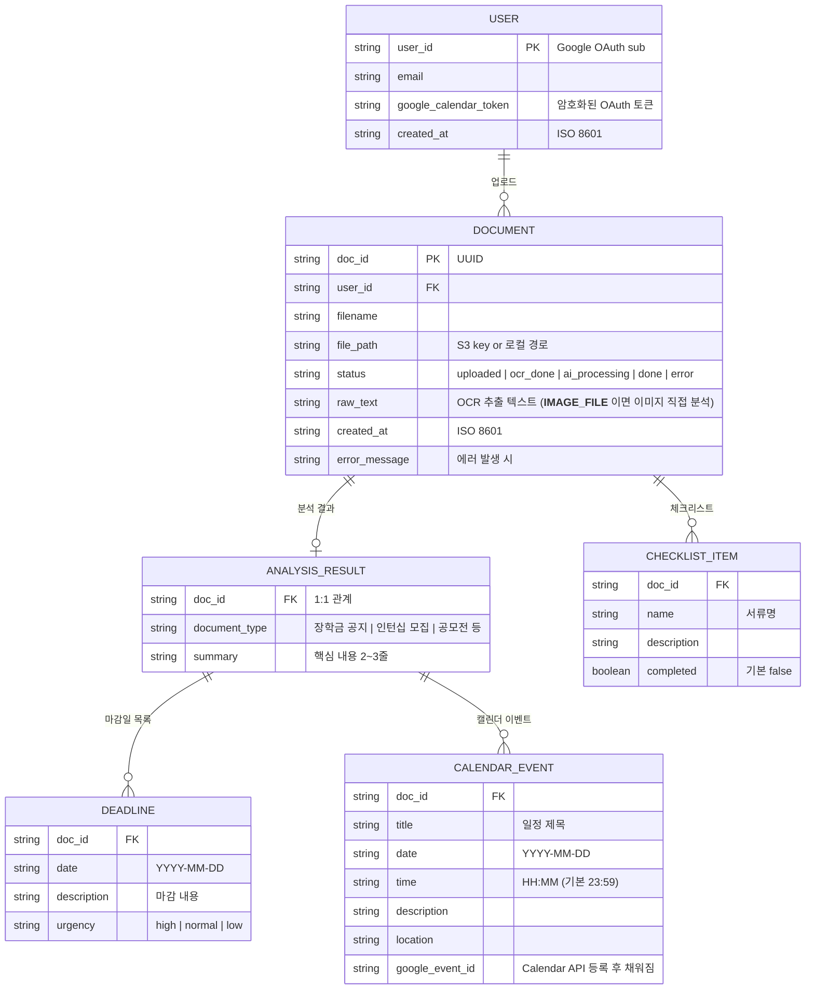

# LittleBoss DB 다이어그램

## 환경별 스토리지 구조

| 환경 | 스토리지 | 파일 저장 |
|------|----------|----------|
| `ENV=local` | JSON 파일 (`backend/local_db/*.json`) | 로컬 임시폴더 (`%TEMP%/littleboss_uploads/`) |
| `ENV=production` | AWS DynamoDB | AWS S3 |

---

## ER 다이어그램



---

## 테이블별 상세 스키마

### USERS

| 필드 | 타입 | 제약 | 설명 |
|------|------|------|------|
| `user_id` | String | PK | Google OAuth `sub` 값 |
| `email` | String | NOT NULL | 구글 계정 이메일 |
| `google_calendar_token` | String | nullable | 암호화된 Refresh Token (Lambda 환경변수에 저장) |
| `created_at` | String | NOT NULL | ISO 8601 형식 |

---

### DOCUMENTS

| 필드 | 타입 | 제약 | 설명 |
|------|------|------|------|
| `doc_id` | String | PK | UUID v4 자동 생성 |
| `user_id` | String | FK → USERS | 업로드한 사용자 |
| `filename` | String | NOT NULL | 원본 파일명 |
| `file_path` | String | NOT NULL | 로컬: 절대경로 / AWS: S3 key |
| `status` | String | NOT NULL | 아래 상태 흐름 참고 |
| `raw_text` | String | nullable | OCR 추출 텍스트. 이미지 파일이면 `__IMAGE_FILE__` |
| `analysis` | JSON | nullable | `ANALYSIS_RESULT` 내용 (비정규화 저장) |
| `checklist` | JSON Array | nullable | `CHECKLIST_ITEM` 목록 (비정규화 저장) |
| `created_at` | String | NOT NULL | ISO 8601 형식 |
| `error_message` | String | nullable | 에러 발생 시 메시지 |

#### 문서 상태 흐름

```
uploaded → (OCR 처리) → ocr_done → (AI 분석) → done
                ↓                        ↓
              error                    error
```

| 상태 | 설명 |
|------|------|
| `uploaded` | 파일 저장 완료, 처리 대기 |
| `ai_processing` | AI 분석 중 |
| `ocr_done` | OCR 완료, AI 분석 대기 |
| `done` | 전체 파이프라인 완료 |
| `error` | 처리 중 오류 발생 |

---

### ANALYSIS_RESULT (DOCUMENT에 비정규화 포함)

| 필드 | 타입 | 설명 |
|------|------|------|
| `document_type` | String | 서류 종류 (장학금 공지, 인턴십 모집, 공모전 등) |
| `summary` | String | 문서 핵심 내용 2~3줄 요약 |
| `deadlines` | Array | `DEADLINE` 객체 목록 |
| `required_documents` | Array | `CHECKLIST_ITEM` 원본 데이터 목록 |
| `calendar_events` | Array | `CALENDAR_EVENT` 객체 목록 |

---

### DEADLINE (ANALYSIS_RESULT 내 배열)

| 필드 | 타입 | 설명 |
|------|------|------|
| `date` | String | `YYYY-MM-DD` 형식 |
| `description` | String | 마감 내용 (예: "장학금 신청 마감") |
| `urgency` | String | `high` / `normal` / `low` |

---

### CALENDAR_EVENT (ANALYSIS_RESULT 내 배열)

| 필드 | 타입 | 설명 |
|------|------|------|
| `title` | String | 일정 제목 |
| `date` | String | `YYYY-MM-DD` 형식 |
| `time` | String | `HH:MM` 형식 (기본값 `23:59`) |
| `description` | String | 일정 설명 |
| `location` | String | 장소 (optional) |

---

### CHECKLIST_ITEM (DOCUMENT에 비정규화 포함)

| 필드 | 타입 | 설명 |
|------|------|------|
| `name` | String | 서류명 (예: "성적증명서") |
| `description` | String | 서류 설명 |
| `completed` | Boolean | 준비 완료 여부 (기본 `false`) |

---

## AWS DynamoDB 인덱스 설계 (프로덕션)

### littleboss-documents 테이블

| 인덱스 종류 | Partition Key | Sort Key | 용도 |
|------------|--------------|----------|------|
| Primary Key | `doc_id` | - | 단건 조회 |
| GSI: `user_id-index` | `user_id` | `created_at` | 유저별 문서 목록 최신순 조회 |

### littleboss-users 테이블

| 인덱스 종류 | Partition Key | Sort Key | 용도 |
|------------|--------------|----------|------|
| Primary Key | `user_id` | - | 단건 조회 |
| GSI: `email-index` | `email` | - | 이메일로 사용자 조회 |

---

## 로컬 JSON 파일 예시

`backend/local_db/{doc_id}.json`:

```json
{
  "doc_id": "711d89d3-7a65-4de8-8369-fb3ffd689bf5",
  "user_id": "local_user",
  "filename": "장학금공지.pdf",
  "file_path": "/tmp/littleboss_uploads/711d89d3_장학금공지.pdf",
  "status": "done",
  "raw_text": "2026학년도 1학기 장학금 신청 안내...",
  "created_at": "2026-03-10T16:10:40.123456",
  "error_message": "",
  "analysis": {
    "document_type": "장학금 공지",
    "summary": "2026년 1학기 장학금 신청 안내. 3월 31일까지 신청 가능.",
    "deadlines": [
      { "date": "2026-03-31", "description": "장학금 신청 마감", "urgency": "high" }
    ],
    "required_documents": [
      { "name": "성적증명서", "description": "최근 1학기", "have": false },
      { "name": "재학증명서", "description": "현재 재학 중 증명", "have": false }
    ],
    "calendar_events": [
      { "title": "장학금 신청 마감", "date": "2026-03-31", "time": "23:59", "description": "장학금 서류 제출 마감일" }
    ]
  },
  "checklist": [
    { "name": "성적증명서", "description": "최근 1학기", "completed": false },
    { "name": "재학증명서", "description": "현재 재학 중 증명", "completed": true }
  ]
}
```
