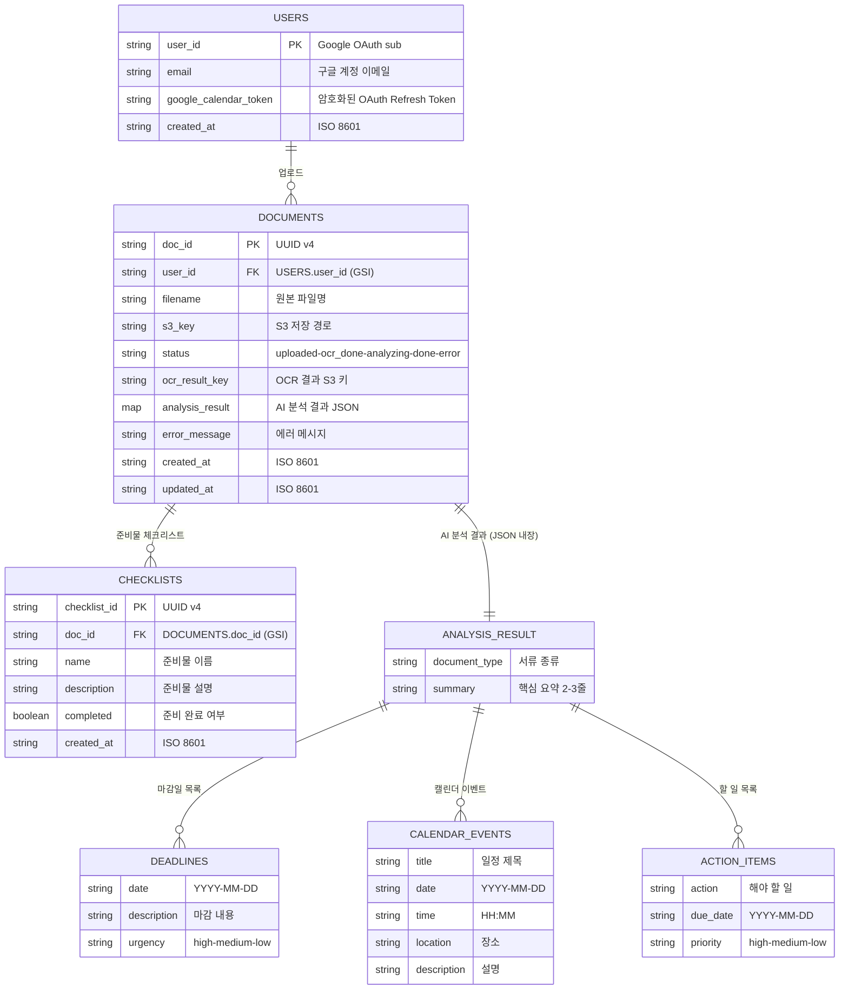
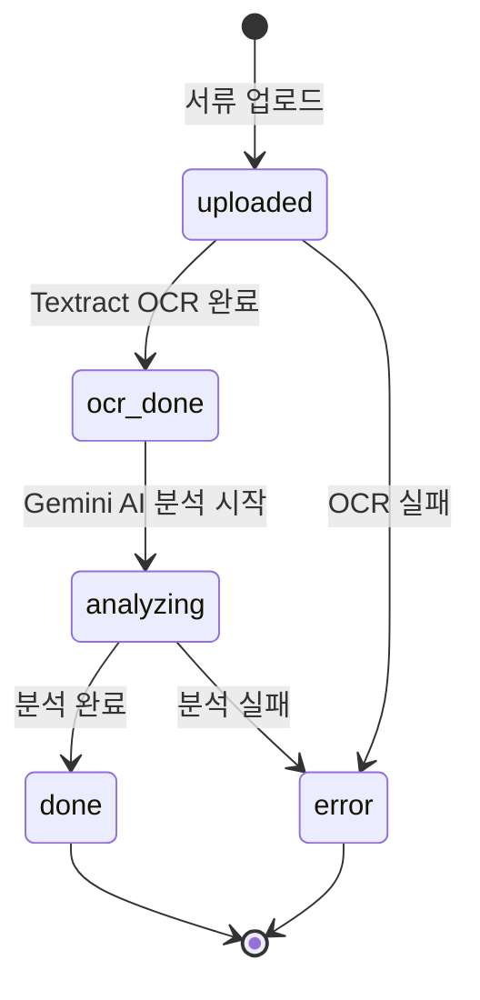

# LittleBoss ERD (Entity Relationship Diagram)

> 아래 Mermaid 코드를 https://mermaid.live 에 붙여넣으면 이미지로 다운로드 가능

---

## DynamoDB 테이블 매핑

| 논리 엔티티 | DynamoDB 테이블 | PK | GSI |
|------------|----------------|-----|-----|
| USERS | `sgu-pj-01-users` | `user_id` | `email-index` |
| DOCUMENTS | `sgu-pj-01-documents` | `doc_id` | `user_id-index` |
| CHECKLISTS | `sgu-pj-01-checklists` | `checklist_id` | `doc_id-index` |
| ANALYSIS_RESULT | `sgu-pj-01-documents`의 `analysis_result` 필드 (비정규화) | - | - |
| DEADLINES | `analysis_result.deadlines` 배열 | - | - |
| CALENDAR_EVENTS | `analysis_result.calendar_events` 배열 | - | - |
| ACTION_ITEMS | `analysis_result.action_items` 배열 | - | - |

---

## 문서 상태 흐름도

