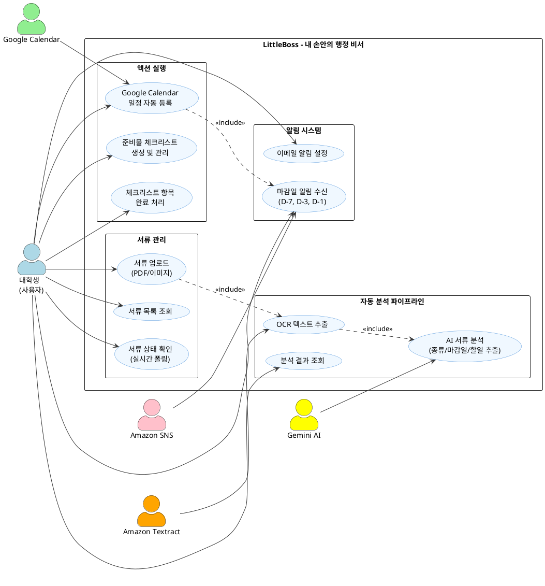

# LittleBoss Use Case Diagram

> 아래 PlantUML 코드를 https://www.plantuml.com/plantuml/uml 에 붙여넣으면 이미지로 다운로드 가능
> Mermaid는 Use Case 다이어그램을 공식 지원하지 않으므로 PlantUML 사용



---

## Use Case 설명

### 1. 서류 관리
| UC | 이름 | Actor | 설명 |
|----|------|-------|------|
| UC1 | 서류 업로드 | 대학생 | PDF/이미지 파일을 드래그앤드롭으로 업로드 |
| UC2 | 서류 목록 조회 | 대학생 | 업로드한 서류 목록과 처리 상태 확인 |
| UC3 | 서류 상태 확인 | 대학생 | 업로드 → OCR → 분석 진행 상태 실시간 폴링 |

### 2. 자동 분석 파이프라인 (비동기)
| UC | 이름 | Actor | 설명 |
|----|------|-------|------|
| UC4 | OCR 텍스트 추출 | Textract | S3 업로드 시 자동 트리거, 문서에서 텍스트 추출 |
| UC5 | AI 서류 분석 | Gemini AI | OCR 완료 시 자동 트리거, 마감일/할일/일정 추출 |
| UC6 | 분석 결과 조회 | 대학생 | 분석된 서류 종류, 마감일, 준비물, 캘린더 이벤트 확인 |

### 3. 액션 실행
| UC | 이름 | Actor | 설명 |
|----|------|-------|------|
| UC7 | 캘린더 일정 등록 | 대학생, Google Calendar | AI가 추출한 일정을 Google Calendar에 자동 등록 |
| UC8 | 체크리스트 생성 | 대학생 | AI가 추출한 준비물 목록을 체크리스트로 생성 |
| UC9 | 체크리스트 완료 처리 | 대학생 | 준비물 항목을 하나씩 체크 |

### 4. 알림 시스템
| UC | 이름 | Actor | 설명 |
|----|------|-------|------|
| UC10 | 마감일 알림 | SNS | 마감 D-7, D-3, D-1에 이메일 알림 자동 발송 |
| UC11 | 이메일 알림 설정 | 대학생 | 알림 수신 이메일 등록 및 구독 확인 |

---

## 비동기 파이프라인 흐름

```
사용자 업로드 (UC1)
    ↓ S3 이벤트 트리거 (자동)
OCR 추출 (UC4) - Amazon Textract
    ↓ Lambda 직접 호출 (자동)
AI 분석 (UC5) - Gemini 2.0 Flash
    ↓ DynamoDB 저장 (자동)
사용자 결과 확인 (UC6) - 프론트엔드 폴링
    ↓ 사용자 클릭 (수동)
캘린더 등록 (UC7) + 체크리스트 생성 (UC8)
    ↓ EventBridge 스케줄 (자동)
마감일 알림 (UC10) - SNS 이메일
```
